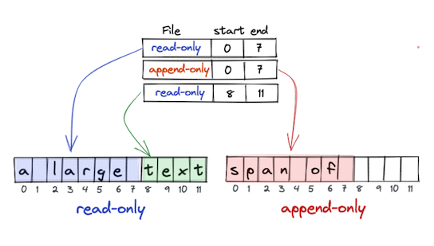
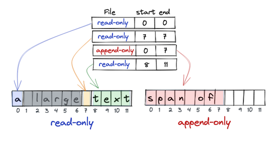
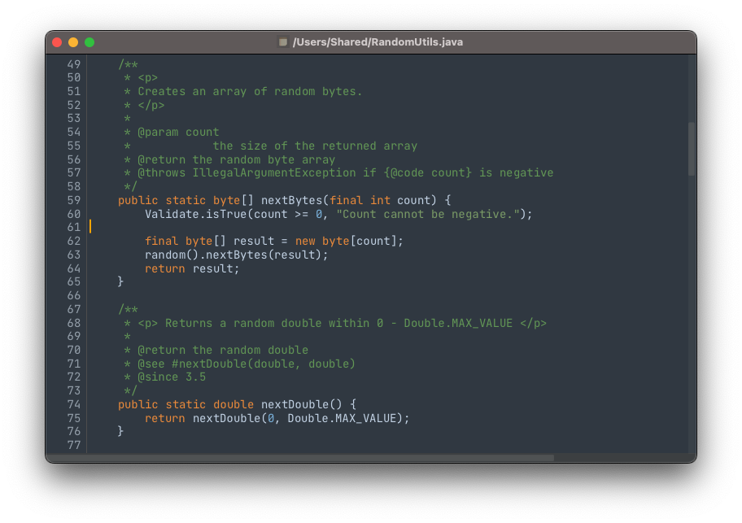

# piecetable

[](https://github.com/naotsugu/jpa-fluent-query/actions/workflows/gradle-build.yml)


Piece table data structure in Java.

For memory efficiency, Unicode retention is handled as a UTF-8 byte array instead of UTF-16.

Supports undo and redo.


## Operations

### Initial state

A piece table consists of three columns:

* Which buffer
* Start index in the buffer
* Length in the buffer

In addition to the table, two buffers are used to handle edits:

* `read-only` : A buffer to the original text document
* `append-only` : A buffer to a temporary file


### Insert

Inserting characters to the text consists of:

* Appending characters to the `read-only` buffer, and
* Updating the entry in piece table (breaking an entry into two or three)




### Delete

Single character deletion can be one of two possible conditions:

* The deletion is at the start or end of a piece entry, in which case the appropriate entry in piece table is modified.
* The deletion is in the middle of a piece entry, in which case the entry is split then one of the successor entries is modified as above.




## Project detail

|directory|description|
|--------------|-- |
|`lib`|Piece table implementation|
|`app`|Example app of editor(sloppy)|


### How to run the application

Clone repository.

```
$ git clone https://github.com/naotsugu/piecetable.git
$ cd piecetable
```

Run app

```
$ .gradlew run
```




